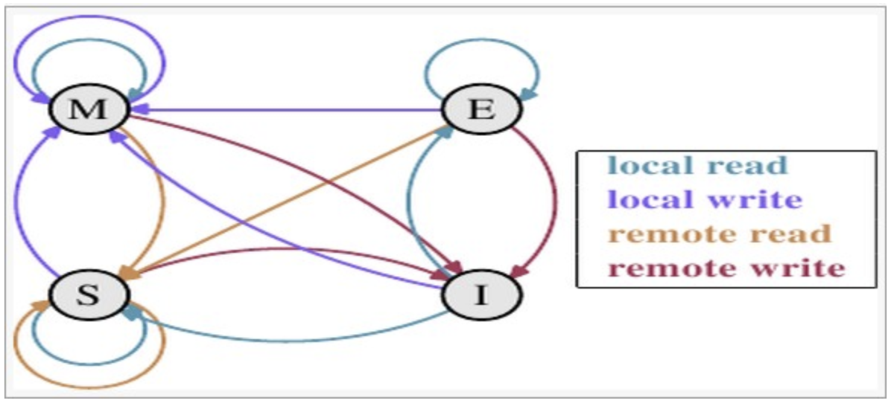

# 一、基础概念

## 1：并发

​	同时拥有两个或多个线程，如果程序在单核处理器上运行，多个线程将交替地换入或者换出内存，这些线程是同时“存在”的，每个线程都处于执行过程中的某个状态，如果运行在多核处理器上，此时，程序中的每个线程都将分配到一个处理器核上，因此可以同时运行

## 2：高并发：（High Concurrency）

​         是互联网分布式系统架构设计中必须考虑的因素之一，它通常是指，通过设计保证系统能够**同时并行处理**很多请求

## 3：高并发与并发的对比

​	并发：多个线程操作相同的资源，保证线程安全，合理使用资源

​	高并发：服务能同时处理很多请求，提高程序性能（如：双十一，12306抢票）

## 4：CPU多级缓存

Bus：总线，是计算机各种功能部件之间传送信息的公共通信干线

Main Memory：主内存

Cache：高速缓存

1.2Cache：二级缓存


### 为什么需要CPU Cache：

​	CPU的频率太快了，主存跟不上，这样在处理器时钟周期内，CPU常常需要等待主存，浪费资源。所有Cache（高速缓存）的出现，是为了缓解CPU和内存之间速度的不匹配问题（CPU > Cache > Main Memory）

### CPU Cache 有什么意义：

1）时间局部性：如果某个数据被访问，那么在不久的将来它很可能被再次访问

2）空间局部性：如果某个数据被访问，那么与它相邻的数据很快也可能被访问

### CPU多级缓存 -- 缓存一致性（MESI） 

用于保证多个CPU Cache之间缓存共享数据的一致


| 状态                     | 描述                                                         | 监听任务                                                     |
| ------------------------ | ------------------------------------------------------------ | ------------------------------------------------------------ |
| M 被修改 (Modified)      | 该缓存行只被缓存在该CPU的缓存中，并且是被修改过的，与主存中的数据是不一致的。该缓存行中的内存会在未来某个时间被写回主存，这段时间内是允许其他线程读取主存中的数据的。该缓存行被写回主存之后就会变成E状态 | 缓存行必须时刻监听所有试图读该缓存行相对就主存的操作，这种操作必须在缓存将该缓存行写回主存并将状态变成S（共享）状态否则会被延迟执行。 |
| E 独享、互斥 (Exclusive) | 该缓存行只被缓存在该CPU的缓存中，数据和主存中的数据一致，会在别的线程读取该数据时就会变成S状态，如果被其他线程修改就变成M状态。 | 缓存行也必须监听其它缓存读主存中该缓存行的操作，一旦有这种操作，该缓存行需要变成S（共享）状态。 |
| S 共享 (Shared)          | 该缓存行可能被多个CPU缓存，并且缓存行中的数据与主存一致。当有一个CPU修改该缓存行的时候，其他CPU中的缓存行就会被作废 | 缓存行也必须监听其它缓存使该缓存行无效或者独享该缓存行的请求，并将该缓存行变成无效（Invalid）。 |
| I 无效 (Invalid)         | 该缓存行无效。                                               | 无                                                           |

localRead（本地读取）：读当前CPU缓存中的数据

localWrite（本地写入）：将数据写到当前CPU缓存里面

remoteRead（远端读取）：将内存中的数据读取到该CPU高速缓存

remoteWrite（远程写入）：将数据写回到主存中




### CPU多级缓存 - 乱序执行优化

处理器为提高运算速度而做出违背代码原有顺序的优化

## 5：Java内存模型（Java Memory Model，JMM）

​	Java内存模型规范：规定了一个线程如何和何时可以看到其他线程修改过后的值，以及在必须的时如何同步的访问共享变量

Heap：堆 （运行时的数据区，是由垃圾回收机制负责的，对象存储在堆上，对象的静态变量也随着对象一起存储在堆上）

​	优点：可以动态分配内存大小，生存期也不必事先告诉编译器

​	缺点：因为是动态分配内存，所以存取速度慢

Stack：栈（主要存储基本数据类型）

​	优点：存取速度比堆快，仅次于计算机的寄存器，数据是可以共享的

​	缺点：生存期与内存大小必须是确定的

​	


## 6：同步的八种操作：

Lock（锁定）：作用于主内存的变量，把一个变量标识为一条线程独占状态

Unlock（解锁）：作用于主内存的变量，把一个处于锁定状态的变量释放出来，释放后的变量才可以被其他线程锁定

Read（读取）：作用于主内存的变量，把一个变量值从主内存传输到线程的工作内存中，以便随后的load动作使用

Load（载入）：作用于工作内存的变量，它把read操作从主内存中得到的变量值放入工作内存的变量副本中

Use（使用）：作用于工作内存的变量，把工作内存中的一个变量值传递给执行引擎

Assign（赋值）：作用于工作内存的变量，它把一个从执行引擎接收到的值赋值给工作内存的变量

Store：（存储）：作用于工作内存的变量，把工作内存中的一个变量的值传送到主内存中，以便随后的write的操作

Write（写入）：作用于主内存的变量，它把store操作从工作内存中一个变量的值传递到主内存的变量中

## 7：同步规则 

①：如果把一个变量从主内存中复制到工作内存中，就需要按顺序的执行read和load操作，如果把变量从工作内存中同步回主内存中，就要按顺序地执行store和write操作，但Java内存模型只要求上述操作必须按顺序执行，而没有保证必须是连续执行

②   ：不允许read和load、store和write操作之一单独出现

③   ：不允许一个线程丢弃它的最近assign的操作，即变量在工作内存总改变了之后必须同步到主内存中

④   ：不允许一个线程无原因的（没有发生任何assign操作）把数据从工作内存中同步回主内存中

⑤   ：一个新的变量只能从主内存中诞生，不允许在工作内存中直接使用一个未被初始化（load或assign）的变量。即就是对一个变量事实use和store操作之前，必须先执行过了assign和load操作

⑥   ：一个变量在同一时刻只允许一条线程对其进行lock操作，但lock 操作可以同时被同一条线程重复执行多次，多次执行lock后，只有执行相同次数的unlock操作，变量才会被解锁。Lock和unlock必须成对出现

⑦   ：如果对一个变量执行lock操作，将会清空工作内存中此变量的值，在执行引擎使用这个变量前需要重新执行load或assign操作初始化变量的值


## 8：多线程的优势与劣势


## 9：线程安全性

定义：当多个线程访问某个类时，不管运行时环境采用何种调度方式或者这些进程将如何交替执行，并且在主调代码中不需要任何额外的同步或协同，这个类都能表现出正确的行为，那么就称这个类是线程安全的

线程安全性主要体现在三个方面：

原子性：提供了互斥访问，同一时刻只能有一个线程来对它进行操作

可见性：一个线程对主内存的修改可以及时的被其他线程观察到

有序性：一个线程观察其他线程中的指令执行顺序，由于指令重排序的存在，该观察结果一般是杂乱无序


# 二、线程安全性

## 一、原子性

### 1、Atomic介绍（原子性）

**代码位于atomic包**

#### 	①：AtomicInteger，AtomicLong 类介绍

如果要在多线程中统计数量，就可以尝试使用AtomicInteger这个类

案例：

```java
@Slf4j
@ThreadSafe
public class AtomicExample1 {
    // 请求总数
    public static int clientTotal = 5000;
    // 同时并发执行的线程数
    public static int threadTotal = 200;
    public static AtomicInteger count = new AtomicInteger(0);
    
    public static void main(String[] args) throws Exception {
        ExecutorService executorService = Executors.newCachedThreadPool();

        final Semaphore semaphore = new Semaphore(threadTotal);

        final CountDownLatch countDownLatch = new CountDownLatch(clientTotal);


        for (int i = 0; i < clientTotal ; i++) {
            executorService.execute(() -> {
                try {
                    semaphore.acquire();
                    add();
                    semaphore.release();
                } catch (Exception e) {
                    log.error("exception", e);
                }
                countDownLatch.countDown();
            });
        }
        countDownLatch.await();
        executorService.shutdown();
        log.info("count:{}", count.get());
    }


    private static void add() {
        count.incrementAndGet();
    }
}

```


方法介绍


	incrementAndGet()方法

```java
 /**
   * 原子递增一个当前值。
   *
   * @return 修改后的值
   */
    public final int incrementAndGet() {
		//第一个参数：将当前对象
        //第二个参数：当前对象的值
        //第三个参数：要增加的数
    	return unsafe.getAndAddInt(this, valueOffset, 1) + 1;
}


```


incrementAndGet()方法底层调用的是unsafe方法的getAndAddInt方法


```java
   //var1:为传入过来的对象 也就是案例中的count
   //var2：为当前的值   比如说：3+5   这里的var2就是3
   //var4：为要相加的值  这个就是5
    public final int getAndAddInt(Object var1, long var2, int var4) {
        int var5;
        do {
        	//获取主内存中当前的值
            var5 = this.getIntVolatile(var1, var2);
            //compareAndSwapInt 会比较传入进来的值是否和底层的值相同，相同就更改count值，并返回true
            //不相同就会返回false
        } while(!this.compareAndSwapInt(var1, var2, var5, var5 + var4));
        //返回增加后的值
        return var5;
    }
```

#### ②：LongAdder类

鉴于Atomic类的底层实现是在一个循环里面，但线程竞争激烈的时候就会导致一些性能的问题，这样LongAdder就诞生了

LongAdder底层是将一个Long类型拆分成一个数组，当多线程进行访问的时候，就会使用其中一个下标的值进行添加，最后的统计结果就是这个数组的和

什么时候选用LongAdder?

如果在统计的时候如果有并发更新，可能会有误差，如果在线程竞争激烈的情况下可以优先使用LongAdder，不激烈的情况下使用Atomic是更好的选择，当然，如果你需要毫无误差的数据，就要使用Atiomic

```java
	// 请求总数
    public static int clientTotal = 5000;
    // 同时并发执行的线程数
    public static int threadTotal = 200;
    public static LongAdder count = new LongAdder();

    public static void main(String[] args) throws Exception {
        ExecutorService executorService = Executors.newCachedThreadPool();

        final Semaphore semaphore = new Semaphore(threadTotal);

        final CountDownLatch countDownLatch = new CountDownLatch(clientTotal);

        for (int i = 0; i < clientTotal ; i++) {
            executorService.execute(() -> {
                try {
                    semaphore.acquire();
                    add();
                    semaphore.release();
                } catch (Exception e) {
                    log.error("exception", e);
                }
                countDownLatch.countDown();
            });
        }
        countDownLatch.await();
        executorService.shutdown();
        log.info("count:{}", count);
    }

    private static void add() {
        count.increment();
   	}


```

#### ③：AtomicReference 类

```java
@Slf4j
@ThreadSafe
public class AtomicExample4 {

    private static AtomicReference<Integer> count = new AtomicReference<>(0);

    public static void main(String[] args) {
        //如果值是0就更新成2
        count.compareAndSet(0, 2); // 2
        //如果值是0就更新成1
        count.compareAndSet(0, 1); // no
        count.compareAndSet(1, 3); // no
        count.compareAndSet(2, 4); // 4
        count.compareAndSet(3, 5); // no
        log.info("count:{}", count.get());
    }
}
```

#### ④：AtomicReferenceFieldUpdater 类

```java
@Slf4j
@ThreadSafe
public class AtomicExample5 {

    private static AtomicIntegerFieldUpdater<AtomicExample5> updater =
            AtomicIntegerFieldUpdater.newUpdater(AtomicExample5.class, "count");

    @Getter
    public volatile int count = 100;

    public static void main(String[] args) {

        AtomicExample5 example5 = new AtomicExample5();

        if (updater.compareAndSet(example5, 100, 120)) {
            log.info("update success 1, {}", example5.getCount());
        }

        if (updater.compareAndSet(example5, 100, 120)) {
            log.info("update success 2, {}", example5.getCount());
        } else {
            log.info("update failed, {}", example5.getCount());
        }
    }
}
```

#### ⑤：AtomicStampedReference 类

```java
@Slf4j
@ThreadSafe
public class AtomicExample7 {

    public static void main(String[] args) throws Exception {
        int numberA = 10;
        int numberB = 100;
        AtomicStampedReference<Integer> atomicStampedReference = new AtomicStampedReference<Integer>(numberA, 1);

        /**
         * compareAndSet 参数说明
         * 第一个参数：原始值
         * 第二个参数：修改后的值
         * 第三个参数：期望版本号
         * 第四个参数：更改之后的版本号
         */
        boolean result = atomicStampedReference.compareAndSet(numberA, numberB, atomicStampedReference.getStamp(), atomicStampedReference.getStamp() + 1);
        if (result) {
            log.info("修改成功");
            log.info("版本号为：{}", atomicStampedReference.getStamp());
        }

        /**
         * 因为上一次修改之后版本号为2 ，这里我们期望版本号为3 所以修改失败
         */
        boolean result2 = atomicStampedReference.compareAndSet(numberA, numberB, 3, atomicStampedReference.getStamp() + 1);
        if (!result2) {
            log.info("修改失败");
        }


        log.info("更改后的版本号:{}", atomicStampedReference.getStamp());
        log.info("更改后的值为:{}", atomicStampedReference.getReference());

    }
}
```

#### ⑦：AtomicBoolean 类介绍

```java
@Slf4j
@ThreadSafe
public class AtomicExample6 {

    private static AtomicBoolean isHappened = new AtomicBoolean(false);

    // 请求总数
    public static int clientTotal = 5000;

    // 同时并发执行的线程数
    public static int threadTotal = 200;

    public static void main(String[] args) throws Exception {
        ExecutorService executorService = Executors.newCachedThreadPool();
        final Semaphore semaphore = new Semaphore(threadTotal);
        final CountDownLatch countDownLatch = new CountDownLatch(clientTotal);
        for (int i = 0; i < clientTotal ; i++) {
            executorService.execute(() -> {
                try {
                    semaphore.acquire();
                    test();
                    semaphore.release();
                } catch (Exception e) {
                    log.error("exception", e);
                }
                countDownLatch.countDown();
            });
        }
        countDownLatch.await();
        executorService.shutdown();
        log.info("isHappened:{}", isHappened.get());
    }

    private static void test() {
        if (isHappened.compareAndSet(false, true)) {
            log.info("execute");
        }
    }
}

```


### 2、synchronized  （依赖JVM）

**代码位于sync包中**


锁：

synchronized：依赖JVM

Lock：依赖特殊的CPU指令，代码实现，ReentrantLock

相关代码为 sync 包下面代码

#### ①：修饰对象

修饰代码块：大括号括起来的代码，作用于调用的对象， 称为同步语句块

修饰方法：整个方法，作用于调用对象，称为同步方法

修饰静态方法：整个静态方法，作用于该类所有对象

修饰类：括号括起来的部分，作用于该类所有对象


synchronized：不可中断锁，等作用域的代码执行完才会释放锁，必须等，适合竞争不激烈，可读性好

Lock：可中断锁，可调用unLock释放，多样化同步，竞争激烈是能维持常态

Atomic：竞争激烈时能维持常态，比Lock性能好；只能同步一个值


## 二、可见性

### 1、导致共享变量在线程间不可见的原因

①：线程交叉执行

②：重排序结合线程交叉执行

③：共享变量更新后的值没有在工作内存与主内存间及时更新


### 2、JVM关于synchronized的两条规定

①：线程解锁前，必须把共享变量的最新值刷新到主内存

②：线程加锁时，将清空工作内存中共享变量的值，从而使用共享变量时需要从主内存中重新读取最新的值（注意：加锁和解锁是同一把锁）


### 3、可见性 — volatile

①：通过加入内存屏障和禁止重排序优化来实现

②：对volatile变量写操作时，会在写操作后加入一条store屏障指令，将工作内存中的共享变量值刷新到主内存

③：对volatile变量读操作时，会在读操作前加入一条load屏障指令，从主内存中读取共享变量

### 4、volatile写 

增加了两层屏障之后，在每次volatile写操作之后就会将最新的数据写回主内存


### 5、volatile 读 	

每次都会从主内存中读取共享变量


### 6、volatile使用场景


volatile使用规范

①：对变量的写操作不依赖当前值

②：该变量没有包含在具有其他变量的不变式中


案例：

```java
volatile boolean inited = false;

//线程1：
context = loadContext();
inited = true;


//线程2：
while(!inited){
    sleep();
}


/**
*线程一初始化一个Boolean类型值
*线程二不断循环判断该值是否已经改变
/
```

## 三、有序性

Java内存模型中，允许编译器和处理器对指令进行重排序，但是重排序过程不会影响到单线程程序的执行，却会影响到多线程并发执行的正确性


①：happens-before原则

程序次序规则：一个线程内，按照代码顺序，书写在前面的操作先行发生于书写在后面的操作

锁定规则：一个unlock操作先行发生于后面对同一个锁的lock操作

volatile变量规则：对一个变量的写操作先行发生于后面对这个变量的读操作

传递规则：如果操作A先行发生于操作B，而操作B又先行发生于操作C，则可以得出操作A先行发生于操作C

线程启动原则：Thread对象的start()方法先行发生于此线程的每一个动作

线程中断规则：对线程interrupt() 方法的调用先行发生于被中断线程的代码检测到中断事件的发生

线程终结规则：线程中所有的操作都先行发生于线程的终止检测，我们可以通过Thread.joio()方法、Thread.isAlive()的返回值手段检测到线程已经终止执行

线程对象终结规则：一个对象的初始化完成先行发生于他的finalize()方法的开始


# 三、安全发布对象

## 一、错误的发布对象

**代码位于publish包中**

### 1、发布对象

使一个对象能够被当前范围之外的代码所使用


这样发布的对象是不安全的，因为别的线程一样可以通过getStrs() 方法获取的到数组，然后改变里面的值。这样别的线程取的值就不一样。

```java
public class UnsafePublish {

    private String[] strs = {"a", "b", "c"};

    public String[] getStrs() {
        return strs;
    }

    public static void main(String[] args) {
        UnsafePublish unsafePublish = new UnsafePublish();
        log.info("当前数组的值为：{}", Arrays.toString(unsafePublish.getStrs()));
        String[] strs = unsafePublish.getStrs();
        strs[0] = "aaa";
        log.info("当前数组的值为：{}", Arrays.toString(unsafePublish.getStrs()));
    }
}
```

### 2、对象溢出

一个错误的发布。当一个对象还没有构造完成时，就是它被其他线程所见


在Escape的构造方法中，实例化了一个InnerClass对象， 在InnerClass的构造方法中调用了Escape，这时候的Escape对象是有可能没有构造完成的所以就造成了对象溢出，所以在对象未完成构造之前不允许发布对象的

```java
public class Escape {

    private int number = 10;

    public Escape() {
        System.out.println(number);
        new InnerClass();
    }

    class InnerClass {
        public InnerClass() {
            log.info("{}", Escape.this.number);
        }
    }

    public static void main(String[] args) {
        new Escape();
    }
}
```

## 二、如何安全发布对象

**代码位于singleton包中**

### 1、在静态初始化函数中初始化一个对象引用

### 2、将对象的引用保存到volatile类型域或者AtomicReference对象中

### 3、将对象的引用保存到某个正确构造对象的final类型域中

### 4、将对象的引用保存到一个由锁保护的域中


## 三、线程安全策略

### 1、不可变对象

#### 1）、不可变对象满足的条件

①：对象创建以后其状态就不能修改

②：对象所有域都是final类型

③：对象是正确创建的（在对象创建期间，this引用没有溢出）

### 2、final关键字

修饰类：不能被继承，final类中成员方法都隐式指定为final方法

修饰方法：1、锁定方法不被继承类修改；2、效率（现在已不用使用final进行效率优化)） 一个类的private 方法会被隐式申明为final方法

修饰变量：基本数据类型变量，在初始化之后就不能再修改了。引用类型变量初始化之后就不能再指向另外一个变量

#### 2）、线程封闭

①：Ad-hoc线程封闭：程序控制实现，最糟糕的封闭，忽略

②：堆栈封闭：局部变量，无并发问题

③：ThreadLocal线程封闭：特别好的封闭方法（代码在threadLocal包中）